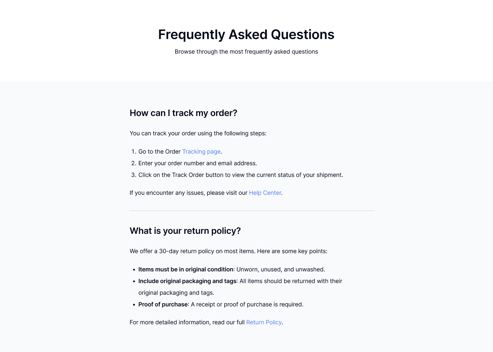
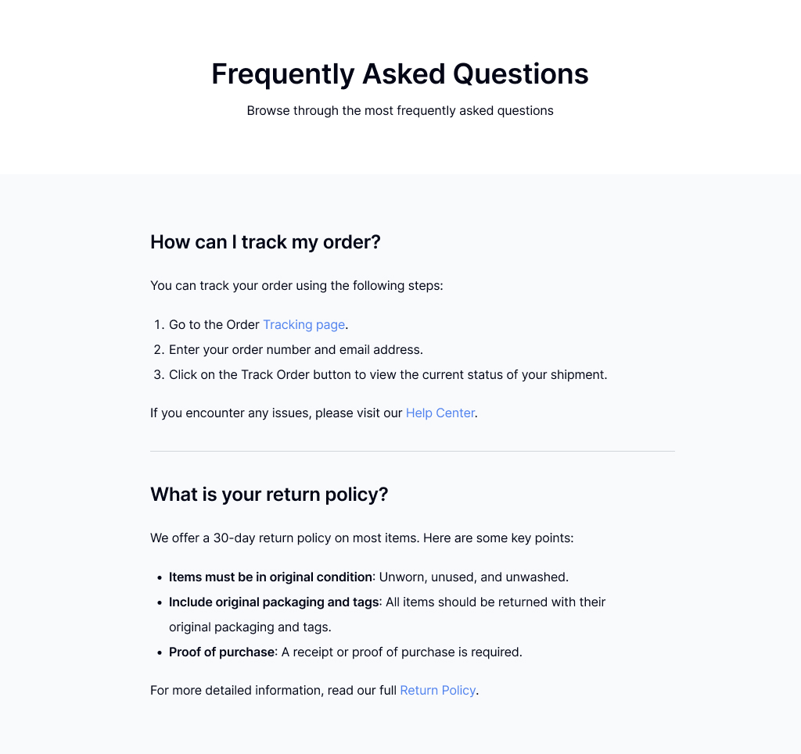

<h1 align="center">Simple FAQ Page | devChallenges</h1>


## Overview

This project is a responsive FAQ (Frequently Asked Questions) page built as part of the devChallenges.io Simple FAQ challenge. The page features an interactive accordion-style interface where users can click on questions to reveal detailed answers.

| Desktop | Tablet | Mobile |
| ------- | ------ | ------ |
|  |  |  |


The page includes two main FAQ items:
1. **How can I track my order?** - Provides step-by-step instructions for order tracking
2. **What is your return policy?** - Details the 30-day return policy with key requirements

### What I learned

Through this project, I enhanced my skills in:

- **Semantic HTML**: Used proper semantic elements like `<main>`, `<header>`, and `<section>` for better accessibility
- **CSS Flexbox**: Implemented flexible layouts for responsive design
- **CSS Transitions**: Created smooth animations for the accordion expand/collapse functionality
- **JavaScript DOM Manipulation**: Built interactive accordion behavior with proper event handling
- **Accessibility**: Implemented ARIA attributes for screen reader compatibility
- **Responsive Design**: Created a mobile-first approach with breakpoints for different screen sizes

Key code implementations:

```css
.faq-answer {
  max-height: 0;
  overflow: hidden;
  transition: max-height 0.3s ease;
}

.faq-item.active .faq-answer {
  max-height: 500px;
}
```

```javascript
question.addEventListener('click', function() {
  const isExpanded = this.getAttribute('aria-expanded') === 'true';
  this.setAttribute('aria-expanded', !isExpanded);
  faqItem.classList.toggle('active');
});
```

### Useful resources

- [MDN Web Docs - ARIA](https://developer.mozilla.org/en-US/docs/Web/Accessibility/ARIA) - Essential for implementing proper accessibility features
- [CSS Tricks - Flexbox Guide](https://css-tricks.com/snippets/css/a-guide-to-flexbox/) - Helped with responsive layout implementation
- [Web.dev - Responsive Design](https://web.dev/responsive-web-design-basics/) - Guided the mobile-first approach

## Built with

- **Semantic HTML5 markup** - For proper document structure and accessibility
- **CSS custom properties** - For consistent theming and easy maintenance
- **Flexbox** - For responsive layout and alignment
- **CSS Transitions** - For smooth accordion animations
- **Vanilla JavaScript** - For interactive accordion functionality
- **Mobile-first responsive design** - Ensuring optimal experience across all devices

## Features

This FAQ page includes:

- ✅ **Interactive Accordion**: Click to expand/collapse FAQ items
- ✅ **Single Item Open**: Only one FAQ can be expanded at a time
- ✅ **Smooth Animations**: CSS transitions for expanding and collapsing
- ✅ **Responsive Design**: Optimized for desktop, tablet, and mobile devices
- ✅ **Accessibility**: ARIA attributes and keyboard navigation support
- ✅ **Modern Styling**: Clean, professional design with hover effects
- ✅ **Semantic HTML**: Proper document structure for SEO and accessibility

This application was created as a submission to a [DevChallenges](https://devchallenges.io/challenges-dashboard) challenge.


## Acknowledgements

- [devChallenges.io](https://devchallenges.io/) for providing this excellent coding challenge
- The web development community for sharing best practices on accessibility and responsive design
